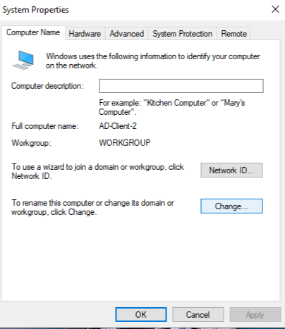
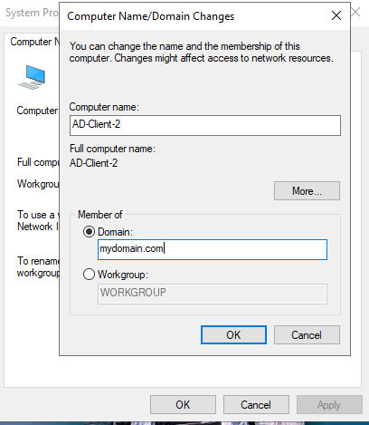
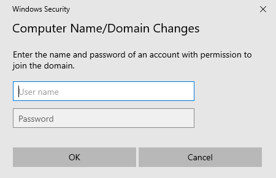
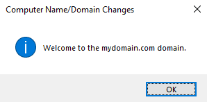

# Installing Active Directory on Windows Server using Azure Virtual Machines

Prerequisites and installation guide for setting up Active Directory Domain Services (AD DS) on a Windows Server hosted in an Azure Virtual Machine.

## Operating Systems
- Windows Server 2019/2022

## Prerequisites
- An active [Azure account](https://portal.azure.com/)
- A Windows Server Virtual Machine (VM) deployed in Azure
- A static private IP address assigned to the VM
- Administrative privileges on the Windows Server VM

## Installation Steps

**1. Deploy a Windows Server VM in Azure**
- Log in to [Azure Portal](https://portal.azure.com/).
- Navigate to **Virtual Machines** > **Create** > **Azure virtual machine**.
.png)
- Choose an appropriate Windows Server image (e.g., Windows Server 2022).
  .png)
- Configure the VM settings:
  - Select a VM size (e.g., `Standard_D2s_v3`)
  - Configure **Administrator** username and password
  - Enable **RDP** access for remote management
    .png)
- Assign a **static private IP address** in the Networking tab.
  .png)
- Click **Review + Create** to deploy the VM.

**2. Configure Networking**
- Navigate to **Virtual Network** in Azure Portal.
- Ensure that the Windows Server VM is connected to the appropriate subnet.
- Update **Network Security Group (NSG)** rules to allow necessary ports:
  - TCP 3389 (RDP) for remote access
  - TCP/UDP 53 (DNS) for domain services
  - TCP 88 (Kerberos authentication)
  - TCP 389 (LDAP) for directory access
  .png)

**3. Install Active Directory Domain Services (AD DS)**
- Connect to the VM using **Remote Desktop (RDP)**.
- Open **Server Manager**.
- Click on **Manage** > **Add Roles and Features**.
.png)
- Select **Role-based or feature-based installation**.
- Choose the local server and click **Next**.
- Select **Active Directory Domain Services**, click **Next**.
- Add required features and proceed with installation.
.png)
- Wait for the installation to complete and restart the server if required.

**4. Promote the Server to a Domain Controller**
- After AD DS installation, open **Server Manager**.
- Click **Notifications** (flag icon) and select **Promote this server to a domain controller**.
.png)
- Choose **Add a new forest** and specify the Root Domain Name (e.g., `mydomain.com`).
  .png)
- Set a **Directory Services Restore Mode (DSRM) password**.
- Proceed with **DNS configuration** (leave default settings if unsure).
- Review the settings and click **Install**.\
  .png)
- The server will restart automatically.

**5. Verify Active Directory Installation**
- After reboot, log in using the domain administrator account.
- Open **Active Directory Users and Computers (ADUC)** by running `dsa.msc`.
- Ensure the domain and organizational units (OUs) are available.
- Test domain functionality by adding a new user:
  - Navigate to **Users** > **New** > **User**.
  - Fill in the details and set a password.
  - Assign appropriate permissions.
  .png)

**6. Configure DNS Settings**
- Open **DNS Manager** (`dnsmgmt.msc`).
- Ensure the new domain is listed under **Forward Lookup Zones**.
  .png)
- Configure client machines to use the domain controller’s private IP as their primary DNS.
- Test name resolution using the `nslookup` command:
  ```powershell
  nslookup mydomain.com
  ```

**7. Join Other VMs to the Domain (Optional)**
- Deploy another Windows VM in the same Azure Virtual Network.
- Change the **DNS settings** of the new VM to point to the domain controller.
.png)
- Join the machine to the domain:
  - Open **System Properties** (`sysdm.cpl`).
    
  - Click **Change** under **Network ID**.
    
  - Select **Domain** and enter the domain name.
  - Authenticate with a domain admin account.
    
    
  - Restart the machine.

## Post-Installation
- Once installed, you can manage users and policies in Active Directory.
- Set up Group Policies, Organizational Units, and enable replication for redundancy.
- Ensure proper backups and security configurations are in place.

## Troubleshooting
If you encounter issues, ensure:
- The VM is correctly assigned a static private IP.
- The AD DS role is installed correctly.
- The server is reachable over the network.
- DNS settings are properly configured on client machines.
